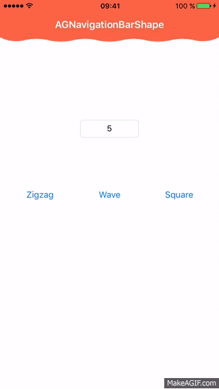
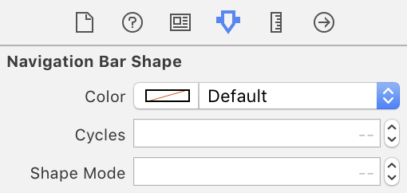

# AGNavigationBarShape

[](https://travis-ci.org/grifas/AGNavigationBarShape)
[](http://cocoapods.org/pods/AGNavigationBarShape)
[](http://cocoapods.org/pods/AGNavigationBarShape)
[](http://cocoapods.org/pods/AGNavigationBarShape)
[](https://developer.apple.com/swift)

iOS Navigation Bar with customs shapes written in Swift 2



To run the example project, clone the repo, and run `pod install` from the Example directory first.

## Installation

####CocoaPods

AGNavigationBarShape is available through [CocoaPods](http://cocoapods.org). To install
it, simply add the following line to your Podfile:

```ruby
pod "AGNavigationBarShape"
```

####Manually
Add the `AGNavigationBarShape.swift` file to your project. 

##Usage

###Setup

Add `import AGNavigationBarShape` in your file

In your app delegate:

```swift
description is coming
```

####Storyboard Support

1. Add `AGNavigationBarShape` Class and  Module to UINavigationController's navigationBar in Identity Inspector


2. If you want to custom it, set options in the Attributes Inspector tab


## Features
-  Choose shape mode (0: Zigzag, 1: Wave) (Zigzag by default)
-  Custom number of shape (10 by default)
-  Custom background color (orange by default) 

## Author

Aurelien Grifasi, aurelien.grifasi@gmail.com

## License

AGNavigationBarShape is available under the MIT license. See the LICENSE file for more info.
